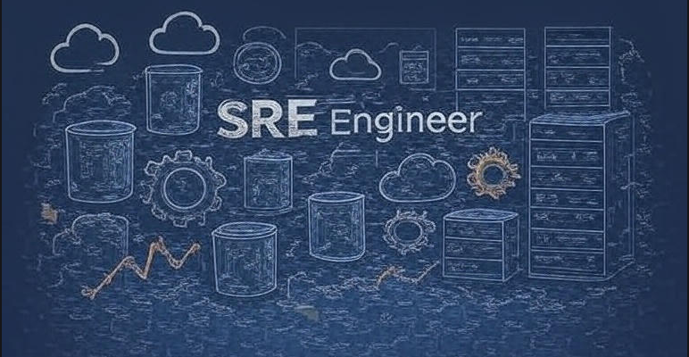

## 👋 About Me
Hello! I'm Peeyush Tyagi, an accomplished Site Reliability Engineer (SRE) with experience in crafting resilient, scalable cloud systems on GCP and AWS. I thrive on Kubernetes orchestration, Infrastructure as Code (IaC) with Terraform and Ansible, and leveraging observability tools like Prometheus and Grafana to ensure operational excellence. Passionate about automating the chaos out of cloud environments and turning downtime into uptime legends.

🔭 Currently scaling vulnerability scanning infrastructures at Astra Security.

🌱 Always learning: Advanced Istio configurations and better infrastructure monitoring

👯 Looking to collaborate on open-source DevOps tools.

💬 Ask me about Kubernetes, CI/CD pipelines, or cloud migrations.

⚡ Fun fact: I once optimized a deployment pipeline to reduce time by 46% – that's faster than my morning coffee brew!

## 🛠️ Skills

  
  
  
  
  
  
  
  
  
  
  
  

## 📈 My GitHub Journey

Pinned some of my favorite projects below – check them out!
- [NoToil](https://github.com/killshotrevival/notoil): A tool specifically designed to reduce toil in SRE organizations. While these tools are built for my personal use cases, you may find interesting solutions and examples that apply to your own work 😉
- [InfraPuzzles](https://github.com/killshotrevival/InfraPuzzles): A collection of unique and advanced infrastructure problems I've solved throughout my career, complete with code examples. Including FinOps challenges, non-trivial infrastructure deployments, amazing configurations that aren't readily available online, and much more 😊

Actively contributing to open-source in the DevOps space.

## 📫 Get in Touch

&nbsp;
&nbsp;
&nbsp;

> Feel free to reach out for collaborations, questions, or just to chat about cloud tech! Let's build something resilient together. 🌟

